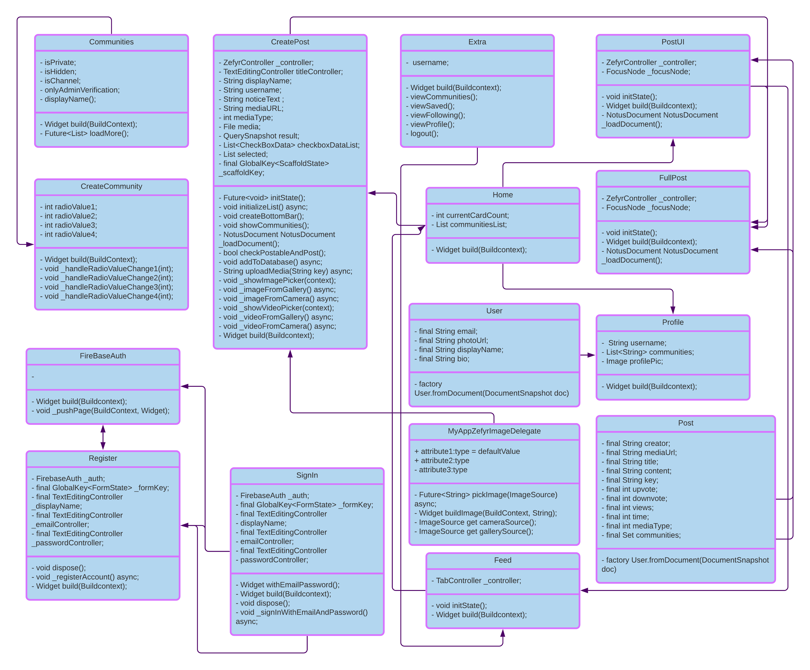

# BrighterBee -by NP Devs

Developing a community for learners. Made for Droidrush: Avishkar MNNIT 2k20.

<b> This app won 1st place in Droidrush.</b>

## Process flow of the app

1. User can register on the app and choose communities he/she wants to be a member of.
2. Users can post articles which may contain image, text, gif, video embedded.
3. Users can upvote/ downvote and comment on any article.
4. User can edit or delete only his/her post but admins can do it for all the posts.
5. Views are counted for every article.
6. Users can stream live video in a community and members of that community can join in to watch the stream.

## Features

1. Articles are in Rich Text Format with images embedded in them.
2. One post can contain one image/ video other than the images present in text itself.
3. Articles can be bookmarked.
4. Communities have option to be made public/ private. Private community cannot be searched but members can only be invited via invite code.
5. Member addition can be made such that admin verification required for it via a setting in community.
6. Feed is generated considering the date of post, the number of upvotes/ downvotes and the number of comments.
7. Users can follow each other to see others public posts in there feed.
8. Users can see the profiles of other users with the posts which are from public groups.
9. Articles and comments will be lazily loaded.
10. Article posting, user follow, admin verification all send push notifications wherever necessary.
11. Users/ posts/ communities can be searched using search bars present throughout the app.
12. It is not necessary to write whole post in one go, users can benefit from the draft feature.
13. The app has full Android 10+ dark theme support.

<i>For more intricate details view screenshots attached below.</i>

# External libraries/APIs used
1. Zefyr editor 0.12: for the Rich Text editor and viewer.
2. Quill delta 1.0.0: to make Notus documents, which helps work on RTF format.
3. Image picker 0.6.7: for picking images and videos from gallery or camera.
4. Firebase Auth 0.18.1: for user login/ signup authentication.
5. Firebase core 0.5.0 and Cloud Firestore 0.14.1: for using Google Cloud Firestore database.
6. Image 2.1.18: for working on images, e.g., compressing them.
7. Agora RTC Engine 3.1.3: for video calling.
8. Firebase Cloud Messaging 7.0.2: for sending push notifications.
9. Shimmer 1.1.2: for shimmer effect in cards
10. Flutter Local Notifications 1.5.0: for displaying notifications
11. Permission Handler 3.0.0: for easy permission handling
12. Date Format 1.0.9: for easy date formatting
13. Path Provider 1.6.18: for getting path for storing temporary files
14. Firebase Storage 4.0.1: for using Firebase Cloud Storage
15. fluttertoast 7.1.1: to display toast messages
16. rxdart 0.24.1: for Firebase stream complex tasks handling
17. Path 1.7.0: to work on file paths
18. Chewie 0.9.10 and Video Player 0.10.9: for easy video player implementation
19. Progress dialog 1.2.4: to show Progress Dialog
20. Cached Network Image 2.3.3: for faster image loading by caching
21. Shared Preferences 0.5.12: to enable Shared Preferences support
22. Photo View 0.10.2: to display full screen zoomable and pannable images.
23. URL Launcher 5.7.6: for URL launching
24. Notus to HTML 0.0.7: to convert Notus Documents to HTML, for sharing
25. share 0.6.5: for sharing content to other apps

## Team details
1. [Ashutosh Chitranshi](https://github.com/ashu12chi)
2. [Nishchal Siddharth Pandey](https://github.com/nisiddharth)
3. [Anushka Srivastava](https://github.com/Anushkaa-Srivastava)

<b> Get the project presentation [here](https://raw.githubusercontent.com/NPDevs/BrighterBee/master/BrighterBee-Final.pptx).</b>

## To try your hands on the project

Either get the latest APK from releases: [https://bit.ly/35uR0uy](https://github.com/NPDevs/BrighterBee/releases/),

Or;

1. Clone the repository
2. Create a Firebase project, add com.npdevs.brighter_bee to it, edit rules as required.
3. Place google-services.json in /android/app/ folder.
4. Build the app, deploy to your device and you are good to go.

## Screenshots

|   |   |   |
|---|---|---|
|Login |Register |Reset password |
|Home screen feed |Post view |Comments and Replies |
|Post options for creator |Post options for viewer |Create post |
|Warning to save draft |Community tab feed | List of member communities |
|Create community |List of all public communities, button at top for private ones |Community home |
|Community options |Admin control panel |Community profile |
|Live stream |Notifications screen |Notifications |
|More options |Search posts |Following list |
|Saved posts |Saved in community |Search communities |
|Search users |User profile |User's posts  |
|Leave community by swipe | Settings |Dark theme feed |
|Dark theme more options screen |Dark theme profile |Dark theme discover screen |

## Class diagram

### Thank you! PRs are always welcomed!

Stay safe!
